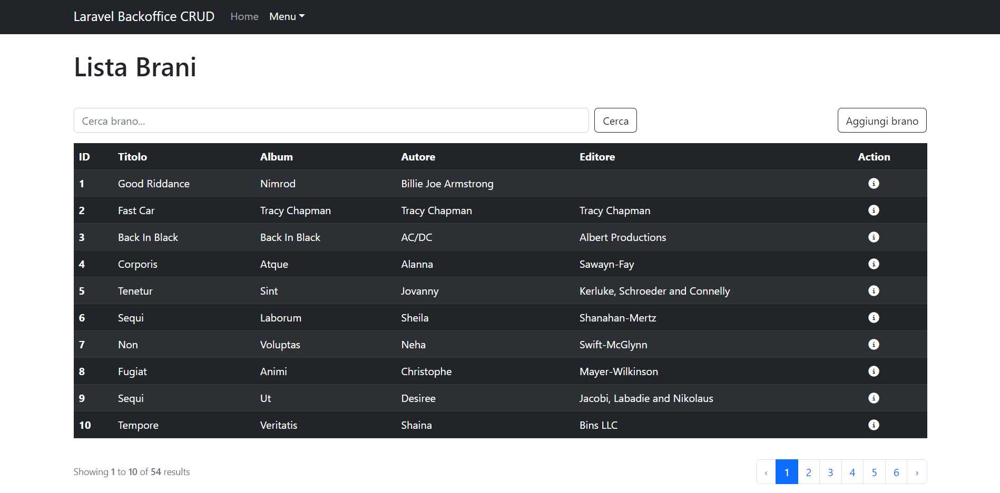
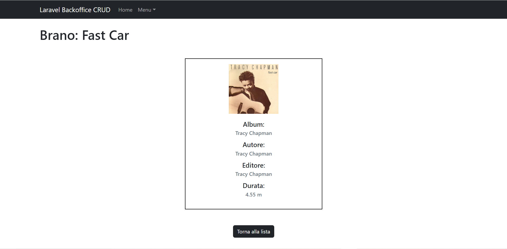
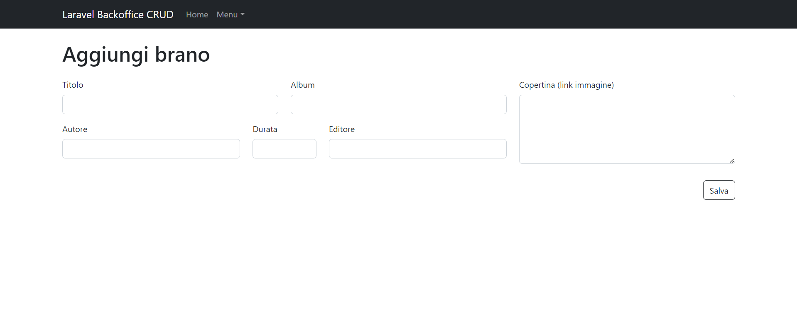

<h1><strong style="color: #EF3B2D;">9 + BOOTSTRAP TEMPLATE</strong></h1>

# Laravel Backoffice CRUD

> Archivio brani musicali

## Tecnologie e Librerie

-   Html
-   Css
-   Sass
-   Bootstrap
-   Php
-   Laravel
-   MySql
-   FakerPHP

## Descrizione

Creazione di un progetto Laravel 9 per gestire un archivio di brani musicali.
Ogni brano dovrà avere:

-   title
-   album
-   author
-   editor
-   length
-   poster

## Milestone 1

Tramite gli appositi comandi artisan creare un model con relativa migration e un resource controller.

## Milestone 2

Iniziate a definire le prime operazioni CRUD con le relative view:
`index()`

`show()`

## Milestone 3

Aggiunta delle rotte `create` e `store` con annesso form.

## Bonus

Creazione del seeder per la tabella songs utilizzando Faker.
