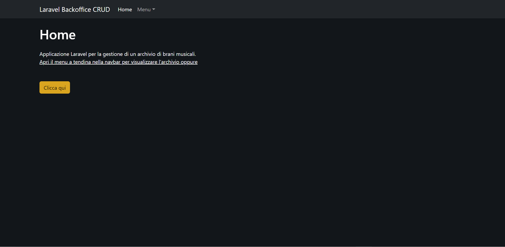
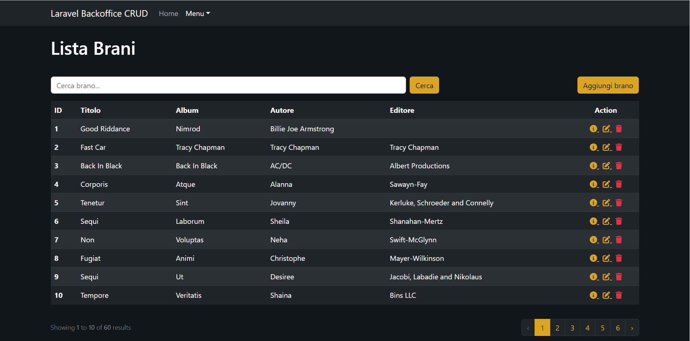
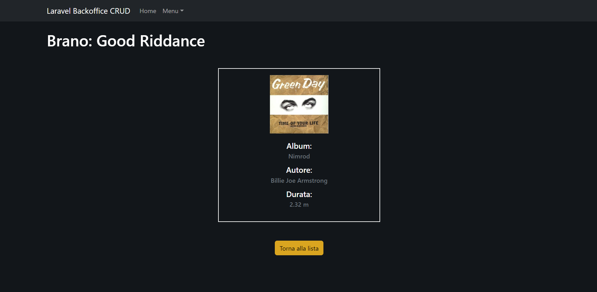
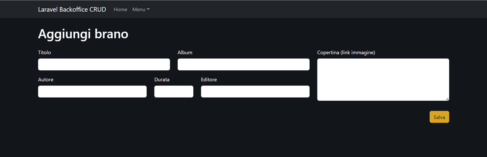
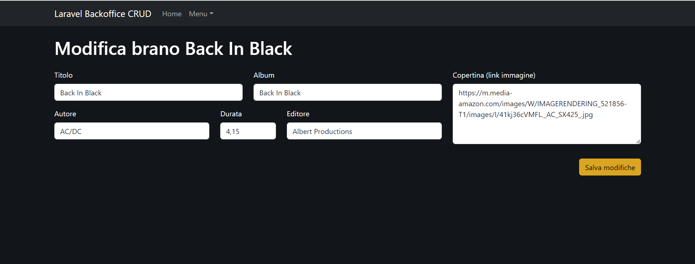
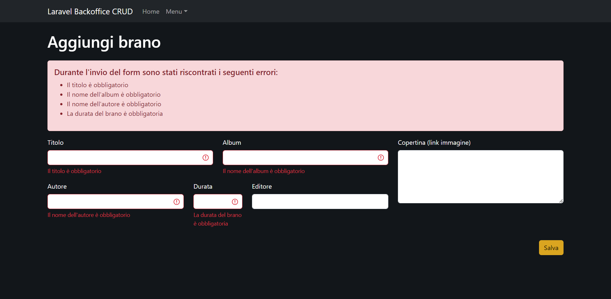
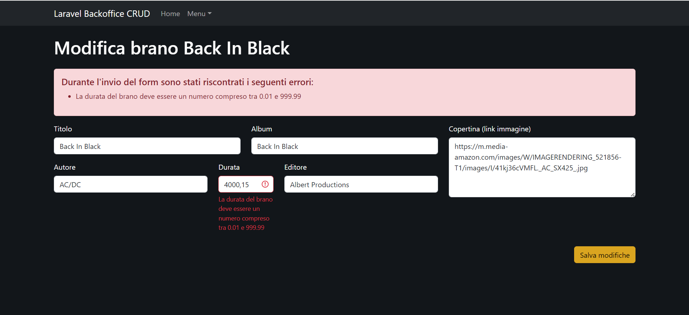

<h1><strong style="color: #EF3B2D;">9 + BOOTSTRAP TEMPLATE</strong></h1>

# Laravel Backoffice CRUD

> Archivio brani musicali

## Tecnologie e Librerie

-   Html
-   Css
-   Sass
-   Bootstrap
-   Php
-   Laravel
-   MySql
-   FakerPHP

## Descrizione

Realizzazione di un progetto Laravel 9 per gestire un archivio di brani musicali lato Back Office, utilizzando tutte le operazioni **CRUD**.
Il tema dell'applicazione è realizzato in _dark mode_.

Ogni brano dovrà avere:

-   title
-   album
-   author
-   editor
-   length
-   poster

## Milestone 1

Tramite gli appositi comandi `artisan` creare un _model_ con relativa _migration_ e un _resource_ controller.

## Milestone 2

Iniziate a definire le prime operazioni CRUD con le relative view:
`index()`, che mostra la lista degli elementi del DB (con relativa paginazione).

`show()`, che mostra il dettaglio del singolo elemento.

## Milestone 3

Aggiunta delle rotte `create` e `store` con annesso form per l'aggiunta ed il salvataggio di nuovi brani.

## Milestone 4

Aggiunta delle rotte `update`, `edit` e `destroy` con annesso form per la modifica ed il salvataggio dei nuovi dati, completando così il ciclo completo delle operazioni CRUD.

Form visualizzato dall' `edit`

## Bonus 1

Creazione del `Seeder` per la tabella songs utilizzando Faker.

## Bonus 2

Validare gli input ricevuti in fase di creazione e modifica, rispondendo con errori chiari e in italiano.

## Bonus 3

Chiedere conferma di eliminazione record via Modal di BS5.

_DA COMPLETARE_...
