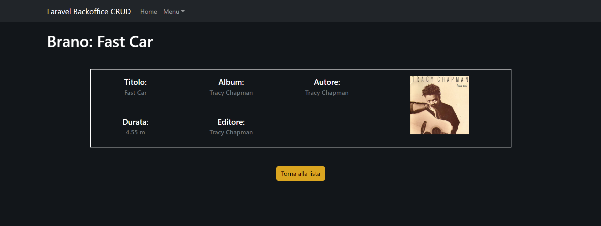
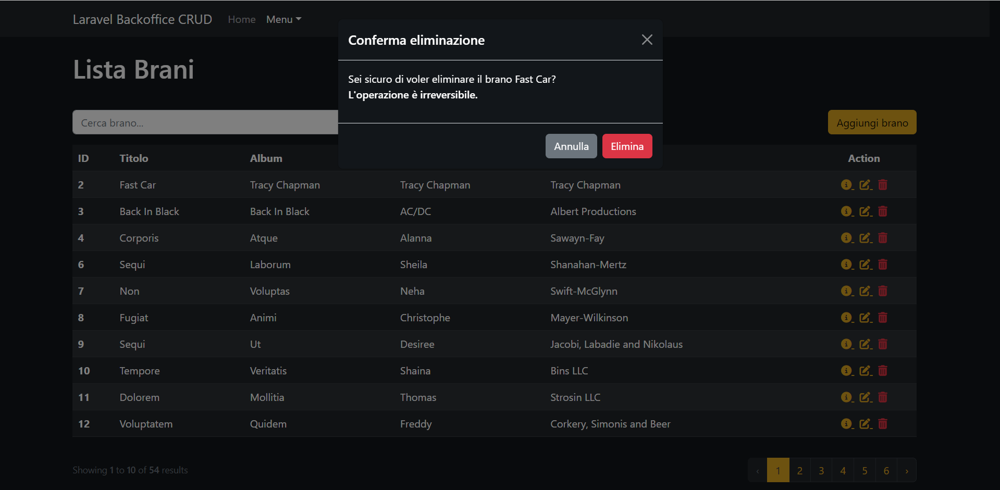

<div align="center"><a href="https://laravel.com" target="_blank"></a>
<h1><strong style="color: #EF3B2D;">9 + BOOTSTRAP TEMPLATE</strong></h1></div>

# Laravel Backoffice CRUD

> Archivio brani musicali


## Tecnologie e Librerie

-   Html
-   Css
-   Sass
-   Bootstrap
-   Php
-   Laravel
-   MySql
-   FakerPHP

## Descrizione

Realizzazione di un progetto Laravel 9 (**progetto Laravel dove sono stati installati Sass e Bootstrap**) per gestire un archivio di brani musicali lato Back Office, utilizzando tutte le operazioni **CRUD** (_dopo lo **Svolgimento** c'è una guida dettagliata per la realizzazione delle **CRUD**_).
Il tema dell'applicazione è realizzato in _dark mode_.

## Svolgimento

Ogni brano dovrà avere:

-   title
-   album
-   author
-   editor
-   length
-   poster

### Milestone 1

Tramite gli appositi comandi `artisan` creare un _model_ con relativa _migration_ e un _resource_ controller.

### Milestone 2

Iniziate a definire le prime operazioni CRUD con le relative view:

`index()`, che mostra la lista degli elementi del DB (con relativa paginazione):


`show()`, che mostra il dettaglio del singolo elemento:



### Milestone 3

Aggiunta delle rotte `create` e `store` con annesso form per l'aggiunta ed il salvataggio di nuovi brani.


### Milestone 4

Aggiunta delle rotte `update`, `edit` e `destroy` con annesso form per la modifica ed il salvataggio dei nuovi dati, completando così il ciclo completo delle operazioni **CRUD**.

Form visualizzato dall' `edit`:


### Bonus 1

Creazione del `Seeder` per la tabella songs utilizzando Faker.

### Bonus 2

Validare gli input ricevuti in fase di creazione e modifica, rispondendo con errori chiari e in italiano.


### Bonus 3

Chiedere conferma di eliminazione record via Modal di BS5.



---

# REALIZZARE UNA CRUD

> Step by step per la realizzazione di una CRUD

## Creare il resource Model

questo comando genera Model e Resource Controller;

```
php artisan make:model Song -r
```

## Creare la Migration

questo comando genera la Migration;

```
php artisan make:migration create_songs_table
```

Dovremo poi inserire la struttura della tabella nella funzione `up` che crea la tabella (e assicurarci che venga cancellata nella funzione `down`, nella quale deve sempre avvenire l'inverso).

```php
// database/migration/xxxx_xx_xx_xxxxxx_create_songs_table.php

/**
 * Run the migrations.
 *
 * @return void
 */
public function up()
{
    Schema::create('songs', function (Blueprint $table) {
        $table->id();
        $table->string('title', 60);
        $table->string('album', 60);
        $table->string('author', 30);
        $table->string('editor', 40)->nullable();
        $table->float('length', 5, 2);
        $table->text('poster')->nullable();
        $table->timestamps();
    });
}

/**
 * Reverse the migrations.
 *
 * @return void
 */
public function down()
{
    Schema::dropIfExists('songs');
}
```

A questo punto possiamo lanciare la Migration con il comando

```
php artisan migrate
```

## Creare il Seeder

questo comando creerà il Seeder

```
php artisan make:seeder SongSeeder
```

nel Seeder possiamo importare i dati di un array o generarli con FakerPHP.
Assicuriamoci di aver importato Faker ed il modello da seeddare

```php
// database/seeders/SongSeeder.php

use App\Models\Song;
use Faker\Generator as Faker;
```

Il metodo run() permetterà il popolamento della tabella. Al suo interno Faker genererà tutti i dati di solito con un ciclo `for`.
**N.B.** Bisogna passare Faker come argomento usando una dependecy injection.

```php
// database/seeders/SongSeeder.php

/**
 * Run the database seeds.
 *
 * @return void
 */
public function run(Faker $faker)
{
    for($i = 0; $i < 50; $i++) {
        $song = new Song;

        $song->title = $faker->word();
        $song->album = $faker->word();
        $song->author = $faker->firstName(null);
        $song->editor = $faker->company() ;
        $song->length = $faker->randomFloat(2, 1, 120);
        $song->poster = 'https://picsum.photos/150/150';

        $song->save();
    }
}
```

Nella funzione `run()` del file DatabaseSeeder.php va aggiunta la call per il seeder creato (ed ogni altro seeder che va lanciato col comando `db:seed`)

```php
// database/seeders/DatabaseSeeder.php

public function run()
{
    $this->call([
        SongSeeder::class
    ]);
}
```

Possiamo poi popolare il DB col comando:

```
php artisan db:seed
```

## Gestire le Rotte

dobbiamo importare il Controller che si occuperà di gestire la risorsa nel file `web.php`

```php
// routes/web.php

use App\Http\Controllers\SongController;
```

Poi usando il metodo statico `resource()` della classe `Route` generiamo tutte le rotte della **CRUD** e le associamo al Controller preposto alla gestione della risorsa

```php
// routes/web.php

Route::resource('songs', SongController::class);
```

## Il Controller CRUD

usando il parametro `-r` nella creazione del modello, questo risulterà già importato nel Controller.
Diversamente dovremo accertarci che lo sia

```php
// app/Http/Controllers/SongController

use\App\Model\Song;
```

### R - READ

La lettura delle risorse dal Database

#### index - La lista

nel metodo index recupereremo i risultati con il metodo statico del modello `::all()`, oppure filtrando con `::where(...)->get()`. Se avessimo bisogno della paginazione, possiamo sostituire `all()` o `get()` con il metodo `paginate(n_items_per_page)`.

```php
// app/Http/Controllers/SongController

/**
 * Display a listing of the resource.
 *
 * @return \Illuminate\Http\Response
 */
public function index()
{
    $songs = Song::paginate(10);
    return view('songs.index', compact('songs'));
}
```

A questo punto stiamo ritornando i dati al template `index.blade.php` nella cartella songs della risorsa. Dobbiamo perciò crearlo

```html
<!-- resources/views/songs/index.blade.php -->

<table class="table">
    <thead>
        <tr>
            <th scope="col">ID</th>
            <th scope="col">Titolo</th>
            <th scope="col">Album</th>
            <th scope="col">Autore</th>
            <th scope="col">Editore</th>
            <th scope="col">Action</th>
        </tr>
    </thead>
    <tbody>
        @foreach($songs as $song)
        <tr>
            <th scope="row">{{$song->id}}</th>
            <td>{{($song->title)}}</td>
            <td>{{($song->album)}}</td>
            <td>{{$song->author}}</td>
            <td>{{$song->editor}}</td>
            <td>...</td>
        </tr>
        @endforeach
    </tbody>
</table>

<!-- Se è stata usata la paginazione -->
{{$songs->links('pagination::bootstrap-5')}}
```

#### show - Il Dettaglio

Andiamo a creare il dettaglio della singola risorsa.
Nel metodo `show` del Controller

```php
// app/Http/Controllers/SongController

/**
 * Display the specified resource.
 *
 * @param  \App\Models\Song $song
 * @return \Illuminate\Http\Response
 */
public function show(Song $song)
{
    return view('songs.show', compact('song'));
}
```

e la sua vista

```html
<!-- resources/views/songs/show.blade.php -->
<!-- Da questo file devo entrare in -->
<!-- resources/views/partials/_song_detail_card.blade.php -->

<div>
    <span>Titolo: </span>
    <span>{{ucfirst($song->title)}}</span>
</div>

<div>
    <span>Album: </span>
    <span>{{ucfirst($song->album)}}</span>
</div>

<div>
    <span>Autore: </span>
    <span>{{ucfirst($song->author)}}</span>
</div>

<div>
    <span>Durata: </span>
    <span>{{$song->length}} m</span>
</div>

@if(isset($song->editor))
<div>
    <span>Editore: </span>
    <span>{{$song->editor}}</span>
</div>
@endif

<div>
    <figure>
        poster}}" alt="{{$song->title}} poster" />
    </figure>
</div>
```

infine aggiungiamo il link al dettaglio nella cella "Action" della table

```html
<!-- resources/views/songs/index.blade.php -->

<table class="table">
    ...
    <tbody>
        @foreach($songs as $song)
        <tr>
            <th scope="row">{{$song->id}}</th>
            ...
            <td>
                <a href="{{route('songs.show', ['song'=>$song])}}">
                    Dettaglio
                </a>
            </td>
        </tr>
        @endforeach
    </tbody>
</table>
```

### C - CREATE

#### create - Il form

La rotta `create` dovrà restituire la vista del form

```php
// App/Http/Controllers/SongController.php

/**
 * Show the form for creating a new resource.
 *
 * @return \Illuminate\Http\Response
 */
public function create()
{
    return view('songs.create');
}
```

nella vista, stampiamo tutti gli input.
Il form dovrà:

-   avere method `POST`
-   la sua action punterà alla rotta dello `store`
-   contenere la direttiva `@csrf` per generare il token di sicurezza

```html
<!-- resources/views/songs/create.blade.php -->

<form action="{{route('songs.store')}}" method="POST" class="row">
    @csrf

    <label for="title" class="form-label">Titolo</label>
    <input type="text" class="form-control" id="title" name="title" />

    <label for="album" class="form-label">Album</label>
    <input type="text" class="form-control" id="album" name="album" />

    <label for="author" class="form-label">Autore</label>
    <input type="text" class="form-control" id="author" name="author" />

    <label for="length" class="form-label">Durata</label>
    <input type="number" class="form-control" id="length" name="length" />

    <label for="editor" class="form-label">Editore</label>
    <input type="text" class="form-control" id="editor" name="editor" />

    <label for="poster" class="form-label">Copertina (link immagine)</label>
    <textarea class="form-control" id="poster" name="poster"></textarea>

    <div class="col-12 d-flex">
        <button type="submit" class="btn btn-primary">Salva</button>
    </div>
</form>
```

infine aggiungiamo il link al form di creazione vicino alla lista

```html
<!-- resources/views/songs/index.blade.php -->

<a href="[[route('songs.create')]]" class="btn btn-primary">Crea</a>

<table class="table">
    ...
</table>
```

#### store - Il salvataggio

Predisponiamo il modello a ricevere dati dal form con la variabile d'istanza protetta `$fillable`

```php
// App\Models\Song.php;

class Song extends Model
{
    use HasFactory;

    protected $fillable = [
        'title',
        'album',
        'author',
        'editor',
        'length',
        'poster'
    ];
}
```

Nel metodo `store()` gestiremo la logica del salvataggio reindirizzando l'utente alla rotta `show`

```php
// App/Http/Controllers/SongController.php

/**
 * Store a newly created resource in storage.
 *
 * @param  \Illuminate\Http\Request  $request
 * @return \Illuminate\Http\Response
 */
public function store(Request $request)
{
    $data = $request->all();
    $song = new Song();
    $song->fill($data);
    $song->save();
    return redirect()->route('songs.show', $song);
}
```

### U - UPDATE

#### edit - Il form

La rotta `edit` dovrà restituire la vista del form, inviandole l'istanza da modificare ricevuta tramite dependency injection

```php
// App/Http/Controllers/SongController.php

/**
 * Show the form for editing the specified resource.
 *
 * @return \Illuminate\Http\Response
 */
public function edit(Song $song)
{
    return view('songs.edit', compact('song'));
}
```

nella vista, stampiamo tutti gli input.
Il form dovrà:

-   avere method `POST`
-   la sua action punterà alla rotta dell' `update`
-   contenere la direttiva `@csrf` per generare il token di sicurezza
-   avere la direttiva `@method('PUT')`
-   gli input dovranno contenere i valori originali dell'istanza

```html
<!-- resources/views/songs/update.blade.php -->

<form action="{{route('songs.update')}}" method="POST" class="row">
    @csrf @method('PUT')

    <label for="title" class="form-label">Titolo</label>
    <input
        type="text"
        class="form-control"
        id="title"
        name="title"
        value="{{$song->title}}"
    />

    <label for="album" class="form-label">Album</label>
    <input
        type="text"
        class="form-control"
        id="album"
        name="album"
        value="{{$song->album}}"
    />

    <label for="author" class="form-label">Autore</label>
    <input
        type="text"
        class="form-control"
        id="author"
        name="author"
        value="{{$song->author}}"
    />

    <label for="length" class="form-label">Durata</label>
    <input
        type="number"
        class="form-control"
        id="length"
        name="length"
        value="{{$song->length}}"
    />

    <label for="editor" class="form-label">Editore</label>
    <input
        type="text"
        class="form-control"
        id="editor"
        name="editor"
        value="{{$song->editor}}"
    />

    <label for="poster" class="form-label">Copertina (link immagine)</label>
    <textarea class="form-control" id="poster" name="poster">
        {{$song->poster}}"
    </textarea>

    <div class="col-12 d-flex">
        <button type="submit" class="btn btn-primary">Salva modifiche</button>
    </div>
</form>
```

infine aggiungiamo il link al form di modifica nella cella "Action" della table

```html
<!-- resources/views/songs/index.blade.php -->

<table class="table">
    ...
    <tbody>
        @foreach($songs as $song)
        <tr>
            <th scope="row">{{$song->id}}</th>
            ...
            <td>
                <a href="{{route('songs.show', ['song'=>$song])}}">
                    Dettaglio
                </a>

                <a href="{{route('songs.show', ['song'=>$song])}}">
                    Modifica
                </a>
            </td>
        </tr>
        @endforeach
    </tbody>
</table>
```

#### update - La modifica

Nel metodo `update()` gestiremo la logica della modifica reindirizzando poi l'utente alla rotta `show`

```php
// App/Http/Controllers/SongController.php

/**
 * Update the specified resource in storage.
 *
 * @param  \Illuminate\Http\Request  $request
 * @param  \App\Models\Song $song
 * @return \Illuminate\Http\Response
 */
public function update(Request $request, Song $song)
{
    $data = $request->all();
    $song->update($data);
    return redirect()->route('songs.show', $song);
}
```

### D - DELETE

#### delete - Button e Modale

Dobbiamo aggiungere il `button` per l'eliminazione della risorsa. Attenzione: il click del `button` dovrà far apparire una modale di conferma dell'operazione prima di cancellare effettivamente il record.

**N.B.** l'attributo `data-bs-target` collegherà il `button` alla model con `id` corrispondente

```html
<!-- resources/views/songs/index.blade.php -->

<table class="table">
    ...
    <tbody>
        @foreach($songs as $song)
        <tr>
            <th scope="row">{{$song->id}}</th>
            ...
            <td>
                <a href="{{route('songs.show', ['song'=>$song])}}">
                    Dettaglio
                </a>

                <a href="{{route('songs.show', ['song'=>$song])}}">
                    Modifica
                </a>

                <button
                    type="button"
                    class="btn btn-danger"
                    data-bs-toggle="modal"
                    data-bs-target="#delete-{{$song->id}}"
                ></button>
            </td>
        </tr>
        @endforeach
    </tbody>
</table>
```

Vanno poi generate modali corrispoondenti ai bottoni da posizionare prima della chiusura del tag `body`.
Attenzione: il pulsante "Elimina" in ogni modale dovrà essere all'interno di un vero e prroprio form contenente:

-   method `POST`
-   action che punta alla rotta del `destroy`
-   la direttiva `@csrf` per generare il token di sicurezza
-   la direttiva `@method('DELETE')`

```html
<!-- resources/views/songs/index.blade.php -->

@foreach($songs as $song)
<!-- Modal -->
<div
    class="modal fade"
    id="delete-{{$song->id}}"
    tabindex="-1"
    aria-labelledby="exampleModalLabel"
    aria-hidden="true"
>
    <div class="modal-dialog">
        <div class="modal-content">
            <div class="modal-header">
                <h1 class="modal-title fs-5" id="exampleModalLabel">
                    Conferma eliminazione
                </h1>
                <button
                    type="button"
                    class="btn-close btn-close-white"
                    data-bs-dismiss="modal"
                    aria-label="Close"
                ></button>
            </div>
            <div class="modal-body">
                Sei sicuro di voler eliminare il brano {{$song->title}}?
                <br />
                <p class="fw-semibold">L'operazione è irreversibile.</p>
            </div>
            <div class="modal-footer">
                <button
                    type="button"
                    class="btn btn-secondary"
                    data-bs-dismiss="modal"
                >
                    Annulla
                </button>

                <form
                    action="{{route('songs.destroy', $song)}}"
                    method="POST"
                    class="d-inline-block"
                >
                    @csrf @method('delete')

                    <button type="submit" class="btn btn-danger">
                        Elimina
                    </button>
                </form>
            </div>
        </div>
    </div>
</div>
@endforeach
```

#### destroy - L'eliminazione

Non resta che gestire la logica dell'eliminazione nel Controller

```php
// App\Http\Controllers\SongController.php

/**
 * Remove the specified resource from storage.
 *
 * @param  \App\Models\Song $song
 * @return \Illuminate\Http\Response
 */

    // * Con questa funzione cancello l'elemento dal DB
public function destroy(Song $song)
{
    $song->delete();
    return redirect()->route('songs.index');
}
```

## La Validazione

### Il metodo `validation`

Come prima cosa bisogna importare il `validator` nell Controller

```php
// App\Http\Controllers\SongController.php

use Illuminate\Support\Facades\Validator;
```

Poi creiamo un metodo privato per la logica di validazione in fondo al Controller.

Nel metodo dobbiamo ricevere i dati da validare:

```php
// App\Http\Controllers\SongController.php

private function validation($data) {}
```

Nel metodo statico `make` del `Validator`:

-   il primo parametro saranno i dati da validare
-   il secondo parametro saranno le regole di validazione (array associativo)
-   il terzo parametro (opzionale) saranno i messaggi di errore customizzati (array associativo)

```php
// App\Http\Controllers\SongController.php

private function validation($data) {
    Validator::make(
        $data,
        [
            ... regole di validazione
        ],
        [
            ... messaggi
        ],
    );
}
```

Al metodo `make` dovrà essere concatenato un metodo `->validate()` per eseguire la validazione, ed il risultato sarà ritornato dal nostro metodo privato.

```php
// App\Http\Controllers\SongController.php

private function validation($data) {
    return Validator::make(
        $data,
        [
            ... regole di validazione
        ],
        [
            ... messaggi di errore
        ],
    )->validate();
}
```

Il risultato finale potrebbe somigliare a questo:

```php
// App\Http\Controllers\SongController.php

private function validation($data) {

    return Validator::make(
        $data,
        [
        'title'=>'required|string|max:60',
        'album'=>'required|string|max:60',
        'author'=>'required|string|max:30',
        'editor'=>'nullable|string|max:40',
        'length'=>'required|numeric|between:0.01,999.99',
        'poster'=>'nullable|string',
        ],
        [
        'title.required'=>"Il titolo è obbligatorio",
        'title.string'=>"Il titolo deve essere una stringa",
        'title.max'=>"Il titolo deve essere di massimo 60 caratteri",

        'album.required'=>"Il nome dell'album è obbligatorio",
        'album.string'=>"Il nome dell'album deve essere una stringa",
        'album.max'=>"Il nome dell'album deve essere di massimo 60 caratteri",

        'author.required'=>"Il nome dell'autore è obbligatorio",
        'author.string'=>"Il nome dell'autore deve essere una stringa",
        'author.max'=>"Il nome dell'autore deve essere di massimo 60 caratteri",

        'editor.string'=>"Il nome dell'editore deve essere una stringa",
        'editor.max'=>"Il nome dell'editore deve essere di massimo 60 caratteri",

        'length.required'=>"La durata del brano è obbligatoria",
        'length.numeric'=>"La durata del brano deve essere un numero",
        'length.between'=>"La durata del brano deve essere un numero compreso tra 0.01 e 999.99",

        'poster.string'=>"Il titolo deve essere una stringa",
        ],
    )->validate();
}
```

Nel caso di campi unici, si può accettare anche l'id del record che si sta validando (in caso di modifica) per gestire il controllo in questo modo

```php
// App\Http\Controllers\SongController.php

private function validation($data, $id = null) {
    $unique_ex_number_1_rule = ($id) ? "unique|songs,number_1,$id" : "|unique:songs";
    $unique_ex_number_2_rule = ($id) ? "unique|songs,number_2,$id" : "|unique:songs";

    return Validator::make(
    $data,
        [
            ...,
            "number_1" => "required|integer" . $unique_ex_number_1_rule,
            "number_2" => "required|integer" . $unique_ex_number_2_rule,
            ...
        ],
        [
            ... messaggi di errore
        ]
    )->validate();

}
```

### Validazione nel Controller

Nel metodo `store`:

```php
// App\Http\Controllers\SongController.php

public function store(Request $request)
{
    $data = $this->validation($request->all());
    ...
}
```

Nel metodo `update`:

```php
// App\Http\Controllers\SongController.php

public function update(Request $request, Song $song)
    {
        // Invoco metodo personalizzato che effettua validazioni
        $data = $this->validation($request->all());
        ...
    }
```

### Validazione nelle viste

Possiamo in via generica stampare tutti gli errori di validazione con:

```html
<!-- resources/views/songs/create.blade.php -->
<!-- resources/views/songs/edit.blade.php -->

@if($errors->any())
<div class="alert alert-danger">
    <h5>Durante l'invio del form sono stati riscontrati i seguenti errori:</h5>
    <ul>
        @foreach($errors->all() as $error)
        <li>{{$error}}</li>
        @endforeach
    </ul>
</div>
@endif
```

Vanno però, anche per ognuno degli input, specificati i valori `old` (ossia quelli dell'inserimento la cui validazione è fallita) nei form.

#### create

Per ogni input:

-   abbiamo a disposizione la direttiva `@error('field_name')`, per verificare la validazione dei singoli input. Possiamo usarla per stampare la classe `is-invalid` di BS
-   aggiungiamo il valore `old` come default
-   aggiungiamo il messaggio di errore nel `div.invalid-feedback` successivo all'input; (la variabile `message` è generata automticamente dalla direttiva `@error`)

```html
<!-- resources/views/songs/create.blade.php -->

<input
    type="text"
    class="@error('title') is-invalid @enderror form-control"
    id="title"
    name="title"
    value="{{old('title')}}"
/>
@error('title')
<div class="invalid-feedback">{{$message}}</div>
@enderror
```

#### edit

Per ogni input vale quanto descritto precedentemente nella sezione `create`.

A differenza del `create` possiamo sfruttare il _null coalescent operator_ per i valori di default degli input:

```html
<!-- resources/views/songs/edit.blade.php -->

<input
    type="text"
    class="@error('title') is-invalid @enderror form-control"
    id="title"
    name="title"
    value="{{old('title') ?? $song->title}}"
/>
@error('title')
<div class="invalid-feedback">{{$message}}</div>
@enderror
```
